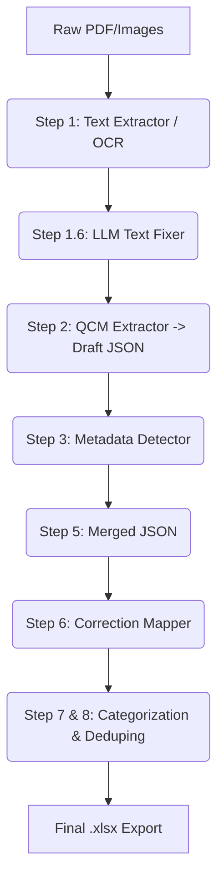

# Product Requirements Document (PRD): QCM Extractor v5.0

## 1. Product Overview
**Name**: QCM Extractor v5.0
**Main Subject**: An automated, AI-driven pipeline designed to parse medical exam PDFs or image documents and extract Multiple Choice Questions (QCMs - "Questions à Choix Multiples"). 
**Core Value Proposition**: It takes unstructured, raw exam documents (often featuring complex layouts, tables, multiple columns, and image-based scans) and converts them into highly structured, standardized JSON and Excel (`.xlsx`) datasets. It intelligently maps correct answers to questions, categorizes them by medical module, persists clinical case narratives across multiple questions, and verifies them against reference databases.

This system is built to minimize manual data entry and human error while tracking API inference costs per run.

## 2. Target Audience & Use Case
- **Medical Students / Educators**: To build massive databases of past medical exams (e.g., Résidanat) for quizzing and learning applications.
- **Data Engineers / Curators**: Automating the ingest pipeline for parsing diverse PDF layouts efficiently while controlling LLM usage costs.

## 3. High-Level Architecture
The system is built as a sequential **8-Step Python CLI tool** with a modular architecture (`main.py` acting as an orchestrator for the `/modules` folder). It supports both an **Interactive CLI Mode** (pausing for user verification) and an **Automatic Batch Mode** (governed by YAML configuration).

### Pipeline Stages (`/modules`)
1. **Step 1: Text Extraction (PDF -> TXT)**
   - **How it works**: Uses either standard PDF text extraction (`pypdfium2`) or Vision OCR via LLMs (e.g., `gemini-2.0-flash-lite`, `qwen3-vl-8b`) to accommodate scanned or complex documents.
   - **Step 1.5 & 1.6 (Text Fixers)**: Intelligent text fixers using `Llama-3.3-70b` to repair broken OCR fragments, merging split words, and correcting Medical French terminology.

2. **Step 2: QCM Content Extraction**
   - **How it works**: Processes the raw text page-by-page. A prompt is dispatched to an extraction LLM (e.g., `gemini-2.5-flash-lite`) enforcing the extraction of Question titles, Options (A, B, C, D, E), and metadata markers.

3. **Step 3: Metadata Detection**
   - **How it works**: Classifies the contextual metadata of extracted questions (Year, Source, Category/Module, Subcategory). 
   - **Modes**: "Global" (one value for the whole exam), "Per-QCM" (changing per question), or "Per-Group" (Clinical Cases / "Cas Clinique" narratives that apply to a specific group of upcoming questions).

4. **Step 4: Format Template Selection**
   - **How it works**: Asserts the extracted QCMs into a standardized JSON template schema (e.g., `pediat`, defined in local JSON template references).

5. **Step 5: JSON Building & Merging**
   - **How it works**: Compiles all the individual page-level extractions into a massive global `.json` representing the entire dataset for the PDF.

6. **Step 6: Correction Processing**
   - **How it works**: Solves the most tedious part—mapping answers keys (corrections) to the questions.
   - **Correction Sources**: 
     - *Page Text / Auto-scan*: Scans the document for answer key tables containing 'X' marks or '1: A,B,C' formats across specific or all pages.
     - *Vision AI*: Identifies circled propositions or checkmarks within the PDF itself.
     - *AI Knowledge*: Generates answers based on standard medical knowledge via deep models (e.g., DeepSeek R1).

7. **Step 7: Per-QCM Categorization**
   - **How it works**: Applies rigorous topic modeling to sub-categorize each question using high-parameter reasoning models.

8. **Step 8: QCM Similarity Matching & Export**
   - **How it works**: Employs vector matching or heuristic matching against a reference database. Assigns stable UUIDs and exports the ultimate artifact: a clean, highly structured `.xlsx` file.

## 4. Key Configurations & Logic Engine
- **`batch_config.yaml`**: The brain of the "Zero-Prompt" Auto-Mode. It sets flags for parallel processing, API models to be used per step, page range limits, and logic tuning (e.g., whether to include neighbors for correction mapping: `include_neighbors: true`).
- **Cost Tracker (`CostTracker` module)**: Monitors tokens utilized during OpenRouter/Gemini API calls and keeps an active budget.
- **State Persistence**: The system persists intermediate outputs step-by-step into `output/<project_name>/step_N.../`. This prevents total pipeline failure if an API times out and enables the "Resume Project" feature.

## 5. Current Weaknesses & Target Areas for Development (For LLM Developer)
If you are passing this PRD to another Agent/LLM for future builds, instruct them to focus on fixing or upgrading these areas:

1. **Cross-Page QCM Splitting**: Currently, if a single question starts at the bottom of Page 4 and finishes at the top of Page 5, page-by-page mapping often clips or duplicates it. **Fix Required**: Implement a dynamic window sliding technique or a pre-processing text stitcher before JSON mapping.
2. **Clinical Case Context Dropping**: If a "Cas Clinique" (Patient Narrative) is on Page 1 but relates to Q1 to Q5 situated on Pages 1 and 2, Step 3 sometimes loses the context when transitioning to Page 2. **Fix Required**: Improve global state propagation across pipeline boundaries.
3. **API Rate Limiting & Instability**: Automatic batch mode sometimes halts unexpectedly. **Fix Required**: Introduce exponential backoff retry mechanisms in the OpenRouter and Google GenAI clients.
4. **Duplicate File Outputs**: During the last export phases (Step 8), synchronization artifacts duplicate sheets or `.xlsx` rows based on previous runs. **Fix Required**: Enhance the stable UUID validation system.

## 6. Proposed New Features (Roadmap)
- **Feature A: Web Dashboard (React/Next.js)**. Convert CLI scripts into FastAPI endpoints and provide a simple UI to highlight/reject data live.
- **Feature B: RAG Verification DB**. Allow the LLM to search medical textbooks to verify if an extracted correction makes factual sense. 
- **Feature C: Live Error Highlighting**. Outputs a final PDF showing bounding boxes of where questions were extracted and matched, so human reviewers don't have to read raw text.

## 7. How It Operates (Flow)

